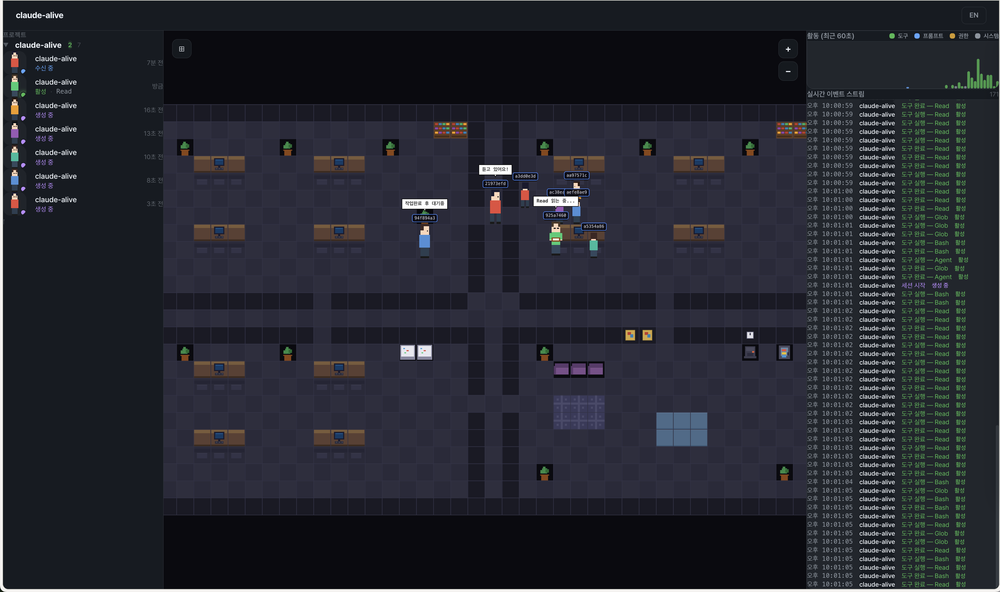

<p align="center">
  <h1 align="center">claude-alive</h1>
  <p align="center">
    Real-time pixel office dashboard for Claude Code sessions<br/>
    Claude Code 세션을 실시간 픽셀 오피스로 시각화하는 대시보드
  </p>
</p>

<p align="center">
  
</p>

<p align="center">
  <a href="#quick-start--빠른-시작">Quick Start</a> •
  <a href="#how-it-works--작동-원리">How It Works</a> •
  <a href="#features--주요-기능">Features</a> •
  <a href="#architecture--아키텍처">Architecture</a> •
  <a href="#development--개발">Development</a> •
  <a href="#license--라이선스">License</a>
</p>

---

## What is claude-alive? / claude-alive란?

**EN**

claude-alive is an open-source monitoring dashboard that brings your Claude Code sessions to life as a pixel art office. When Claude Code runs — writing code, reading files, running tests, spawning sub-agents — you normally only see text scrolling in a terminal. claude-alive captures every one of those lifecycle events through [Claude Code hooks](https://docs.anthropic.com/en/docs/claude-code/hooks) and transforms them into animated pixel characters in a virtual office.

Each agent gets a pixel character that walks around, sits at desks, types on keyboards, and shows speech bubbles with the current tool being used. Sub-agents appear as smaller characters. An org chart overlay lets you see the full agent hierarchy at a glance.

**v0.3.0** adds agent call statistics, per-agent token usage tracking, and an embedded terminal — so you can monitor costs and run Claude CLI commands without leaving the dashboard.

Everything runs locally — no data leaves your machine.

**KO**

claude-alive는 Claude Code 세션을 픽셀아트 오피스로 실시간 시각화하는 오픈소스 모니터링 대시보드입니다. Claude Code가 코드를 작성하고, 파일을 읽고, 테스트를 실행하고, 서브에이전트를 생성할 때 — [Claude Code hooks](https://docs.anthropic.com/en/docs/claude-code/hooks)를 통해 모든 라이프사이클 이벤트를 캡처하고 이를 가상 오피스의 픽셀 캐릭터 애니메이션으로 변환합니다.

각 에이전트는 픽셀 캐릭터로 표현되어 오피스를 돌아다니고, 책상에 앉아 타이핑하고, 말풍선으로 현재 사용 중인 도구를 표시합니다. 서브에이전트는 작은 크기의 캐릭터로 나타납니다. 조직도 오버레이로 에이전트 계층을 한눈에 볼 수 있습니다.

**v0.3.0**에서 에이전트 호출 통계, 에이전트별 토큰 사용량 추적, 내장 터미널이 추가되었습니다. 비용을 모니터링하고 대시보드를 떠나지 않고 Claude CLI 명령을 실행할 수 있습니다.

모든 데이터는 로컬에서만 처리됩니다.

---

## Quick Start / 빠른 시작

### Prerequisites / 필수 조건

- **Node.js** ≥ 20
- **pnpm** (install: `npm install -g pnpm`)
- **Claude Code** installed and working

### Option A: npm install (recommended / 권장)

```bash
# Install globally / 전역 설치
npm install -g claude-alive

# Register hooks with Claude Code / 훅 등록
claude-alive install

# Start the dashboard / 대시보드 시작
claude-alive start
```

Open **http://localhost:3141** — any running Claude Code session will appear automatically.

http://localhost:3141 을 열면 실행 중인 Claude Code 세션이 자동으로 나타납니다.

### Option B: From source / 소스에서 빌드

```bash
# 1. Clone / 클론
git clone https://github.com/hoyoungyang0526/claude-alive.git
cd claude-alive

# 2. Install dependencies / 의존성 설치
pnpm install

# 3. Build all packages / 전체 빌드
pnpm build

# 4. Register hooks / 훅 등록
node packages/cli/dist/index.js install

# 5. Start the server / 서버 시작
node packages/server/dist/index.js
```

Open **http://localhost:3141** and navigate to the **Pixel Office** tab (`#pixel`).

http://localhost:3141 을 열고 **Pixel Office** 탭 (`#pixel`)으로 이동하세요.

### Verify it works / 동작 확인

```bash
# In another terminal, check server status / 다른 터미널에서 서버 상태 확인
claude-alive status
# → {"agents":[],"uptime":...}

# Start a Claude Code session anywhere / 아무 데서나 Claude Code 시작
claude
# → The pixel office should show a new character spawning
# → 픽셀 오피스에 새 캐릭터가 나타나야 합니다
```

### Uninstall / 제거

```bash
# Remove hooks from Claude Code settings / 훅 제거
claude-alive uninstall

# Uninstall globally / 전역 제거
npm uninstall -g claude-alive
```

### CLI Commands / CLI 명령어

| Command | Description | 설명 |
|---------|-------------|------|
| `claude-alive install` | Register hooks in `~/.claude/settings.json` | 훅을 Claude Code 설정에 등록 |
| `claude-alive uninstall` | Remove hooks from settings | 훅 제거 |
| `claude-alive start` | Start the server on port 3141 | 서버 시작 (포트 3141) |
| `claude-alive status` | Check if server is running | 서버 상태 확인 |

**Environment variables / 환경 변수:**

| Variable | Default | Description |
|----------|---------|-------------|
| `CLAUDE_ALIVE_PORT` | `3141` | Server port / 서버 포트 |

---

## How It Works / 작동 원리

```
Claude Code Session
  ↓ hook event (stdin JSON)
~/.claude-alive/hooks/stream-event.sh
  ↓ HTTP POST
localhost:3141/api/event
  ↓ SessionStore + FSM
WebSocket broadcast (/ws)
  ↓
React UI (Pixel Office / Dashboard / Terminal)
```

**EN**

1. **Hooks** — `claude-alive install` copies `stream-event.sh` to `~/.claude-alive/hooks/` and registers it in `~/.claude/settings.json` for all lifecycle events. Claude Code calls this script on every event, passing JSON on stdin.

2. **stream-event.sh** — Reads JSON from stdin and POSTs it to `localhost:3141/api/event`. Runs async with a 5-second timeout so it never blocks Claude Code.

3. **Server** — A lightweight Node.js HTTP + WebSocket server receives events, updates the session store (tracking all agents and states via an FSM), computes aggregate statistics, and broadcasts changes to all connected clients.

4. **UI** — A React app connects via WebSocket and renders three views:
   - **Dashboard** — 3-column layout with project sidebar, agent stats, activity pulse, and event stream
   - **Pixel Office** — Canvas 2D pixel art office where agents are animated characters
   - **Terminal** — Embedded xterm.js terminal for running Claude CLI commands directly

**KO**

1. **훅** — `claude-alive install`이 `stream-event.sh`를 `~/.claude-alive/hooks/`에 복사하고 `~/.claude/settings.json`에 등록합니다. Claude Code는 모든 라이프사이클 이벤트마다 이 스크립트를 호출하며 stdin으로 JSON을 전달합니다.

2. **stream-event.sh** — stdin에서 JSON을 읽어 `localhost:3141/api/event`로 POST합니다. 비동기 실행, 5초 타임아웃으로 Claude Code를 차단하지 않습니다.

3. **서버** — Node.js HTTP + WebSocket 서버가 이벤트를 수신하고, 세션 스토어(FSM으로 에이전트 상태 추적)를 업데이트하고, 통계를 집계하고, 모든 클라이언트에 브로드캐스트합니다.

4. **UI** — React 앱이 WebSocket으로 연결되어 세 가지 뷰를 렌더링합니다:
   - **Dashboard** — 프로젝트 사이드바, 에이전트 통계, 활동 펄스, 이벤트 스트림의 3컬럼 레이아웃
   - **Pixel Office** — Canvas 2D 픽셀아트 오피스에서 에이전트가 캐릭터로 움직임
   - **Terminal** — xterm.js 내장 터미널로 Claude CLI 명령을 직접 실행

### Agent State Machine / 에이전트 상태 머신

```
spawning → listening → active → idle
                ↓         ↓
             waiting    error → active
                ↓
              done → despawning → removed
```

### Supported Hook Events / 지원하는 훅 이벤트

| Event | Triggers |
|-------|----------|
| `SessionStart` / `SessionEnd` | Agent spawn / despawn |
| `PreToolUse` / `PostToolUse` | Active state + tool animation |
| `PostToolUseFailure` | Error state |
| `PermissionRequest` | Waiting state |
| `SubagentStart` / `SubagentStop` | Sub-agent spawn / despawn |
| `UserPromptSubmit` | Character faces user |
| `Stop` | Return to idle |
| `Notification`, `TaskCompleted`, `PreCompact` | Event log |

---

## Features / 주요 기능

### Pixel Office / 픽셀 오피스

**EN:** A 40×24 tile pixel art office with 4 zones (3 work areas + 1 break room). Each agent is a pixel character with 6 color palettes. Characters walk via BFS pathfinding, sit at desks, and show typing/reading animations based on the current tool.

**KO:** 40×24 타일의 픽셀아트 오피스, 4개 존(작업 영역 3개 + 휴게실 1개). 6가지 색상 팔레트의 픽셀 캐릭터. BFS 길찾기로 이동하고, 책상에 앉아 현재 도구에 따라 타이핑/읽기 애니메이션을 표시합니다.

**Office features / 오피스 기능:**
- Desks with monitors, chairs, bookshelves, plants
- Break room with sofa, coffee machine, snack machine, meeting table
- Whiteboards, posters, wall clocks
- Corridors with doors connecting zones

### Agent Hierarchy / 에이전트 계층

**EN:** Toggleable org chart overlay shows parent↔child agent relationships as a tree. Click any node to pan the camera to that character. Nodes show mini character sprites, name, and live status.

**KO:** 토글 가능한 조직도 오버레이가 부모↔자식 에이전트 관계를 트리로 표시합니다. 노드를 클릭하면 해당 캐릭터로 카메라가 이동합니다. 미니 스프라이트, 이름, 실시간 상태를 표시합니다.

### Real-time State Mapping / 실시간 상태 매핑

| Agent State | Character Behavior | 캐릭터 반응 |
|-------------|-------------------|-----------|
| Writing code | Typing animation at desk | 책상에서 타이핑 |
| Reading files | Reading animation | 읽기 애니메이션 |
| Waiting for permission | Yellow bubble "..." | 노란 말풍선 "..." |
| Error | Red bubble "!" | 빨간 말풍선 "!" |
| Idle | Wanders around office | 오피스 돌아다님 |
| Sub-agent spawned | Smaller character appears with matrix effect | 작은 캐릭터 + 매트릭스 이펙트 |

### Multi-Agent & Sub-Agent / 멀티에이전트

**EN:** Sub-agents appear as 75% scale characters. Each gets assigned to the same zone as their parent project. Speech bubbles show the current tool name (e.g., "Read", "Bash", "Edit").

**KO:** 서브에이전트는 75% 크기 캐릭터로 표시. 부모 프로젝트와 같은 존에 배정. 말풍선에 현재 도구명 표시 (예: "Read", "Bash", "Edit").

### Agent Call Statistics (v0.3.0) / 에이전트 호출 통계

**EN:** The right panel now includes an **Agent Stats** card that provides real-time statistics across all agents:
- **Active / Total agents** — How many agents are currently running vs. total tracked
- **Sub-agent types** — Breakdown by agent type (e.g., Explore, Plan, code-reviewer) with purple badges
- **Top 5 tools** — Most-called tools with call counts (e.g., Read: 42, Edit: 18, Bash: 12)
- **Total tokens** — Aggregate token usage across all active agents

Per-agent tool call counts are tracked automatically from `PreToolUse` hook events.

**KO:** 오른쪽 패널에 **에이전트 통계** 카드가 추가되어 모든 에이전트의 실시간 통계를 제공합니다:
- **활성 / 전체 에이전트 수** — 현재 실행 중인 에이전트 수와 전체 추적 중인 에이전트 수
- **서브에이전트 유형** — 유형별 분류 (예: Explore, Plan, code-reviewer), 보라색 뱃지
- **상위 5개 도구** — 가장 많이 호출된 도구와 호출 횟수 (예: Read: 42, Edit: 18, Bash: 12)
- **전체 토큰** — 모든 활성 에이전트의 토큰 사용량 합계

에이전트별 도구 호출 횟수는 `PreToolUse` 훅 이벤트에서 자동으로 추적됩니다.

**API endpoint:**
```bash
# Get aggregated statistics / 집계 통계 조회
curl http://localhost:3141/api/stats
# → {"totalAgents":3,"activeAgents":2,"subagentsByType":{"Explore":1},"toolCallsByName":{"Read":42,"Edit":18}}
```

### Token Usage Tracking (v0.3.0) / 토큰 사용량 추적

**EN:** claude-alive automatically parses Claude Code transcript files (JSONL) when a session ends to extract token usage:
- **Input tokens** — Tokens sent to Claude (including cache)
- **Output tokens** — Tokens generated by Claude
- **Cache tokens** — Cache creation + cache read tokens (saves cost)
- **API calls** — Total number of API round-trips
- **Model** — Which Claude model was used

Token data appears in two places:
1. **Agent Stats card** — Shows total tokens across all agents
2. **Completion Log** — Each completed session shows a token badge (e.g., "12.5k tok")

**How it works:** When an agent session ends (`SessionEnd` or `SubagentStop`), the server reads the transcript JSONL file at `~/.claude/projects/.../transcript_*.jsonl`. It parses each `assistant` message's `usage` field, deduplicates streaming chunks (same `message.id`), and sums the totals.

**KO:** claude-alive는 세션 종료 시 Claude Code 트랜스크립트 파일(JSONL)을 자동으로 파싱하여 토큰 사용량을 추출합니다:
- **입력 토큰** — Claude에 보낸 토큰 수 (캐시 포함)
- **출력 토큰** — Claude가 생성한 토큰 수
- **캐시 토큰** — 캐시 생성 + 캐시 읽기 토큰 (비용 절감)
- **API 호출** — 총 API 왕복 횟수
- **모델** — 사용된 Claude 모델

토큰 데이터는 두 곳에 표시됩니다:
1. **에이전트 통계 카드** — 모든 에이전트의 총 토큰 표시
2. **완료 로그** — 각 완료된 세션에 토큰 뱃지 표시 (예: "12.5k tok")

**작동 방식:** 에이전트 세션이 종료되면 (`SessionEnd` 또는 `SubagentStop`), 서버가 `~/.claude/projects/.../transcript_*.jsonl` 트랜스크립트 JSONL 파일을 읽습니다. 각 `assistant` 메시지의 `usage` 필드를 파싱하고, 스트리밍 청크(같은 `message.id`)를 중복 제거한 후 합산합니다.

**Token data structure / 토큰 데이터 구조:**
```typescript
interface TokenUsage {
  inputTokens: number;      // Tokens sent to Claude / Claude에 보낸 토큰
  outputTokens: number;     // Tokens generated / 생성된 토큰
  cacheCreationTokens: number; // Cache creation / 캐시 생성
  cacheReadTokens: number;  // Cache read / 캐시 읽기
  totalTokens: number;      // inputTokens + outputTokens
  apiCalls: number;         // API round-trips / API 왕복
  model: string;            // e.g., "claude-sonnet-4-20250514"
}
```

### Embedded Terminal (v0.3.0) / 내장 터미널

**EN:** Run Claude CLI commands directly from the dashboard without switching windows. The terminal panel sits at the bottom of the screen and can be toggled open/closed.

**Features:**
- **xterm.js** — Full terminal emulator with ANSI color support, cursor positioning, and scroll history
- **Multi-tab** — Open multiple terminal sessions simultaneously, each with its own shell process
- **Drag-to-resize** — Drag the top edge of the terminal panel to adjust its height (120–600px)
- **Auto-cleanup** — Terminal sessions are automatically closed after 30 minutes of inactivity (configurable)
- **Max sessions** — Up to 5 concurrent terminal sessions (prevents resource leaks)

**Usage / 사용법:**
1. Click the **Terminal** toggle button at the bottom of the dashboard / 대시보드 하단의 **Terminal** 토글 버튼 클릭
2. A terminal tab opens automatically with your default shell / 기본 쉘이 자동으로 열립니다
3. Type commands as you would in any terminal / 일반 터미널처럼 명령어를 입력하세요
4. Click **+** to open additional tabs / **+**를 클릭해 추가 탭 열기
5. Click **×** to close individual tabs / **×**를 클릭해 개별 탭 닫기

**KO:** 창을 전환하지 않고 대시보드에서 직접 Claude CLI 명령을 실행할 수 있습니다. 터미널 패널은 화면 하단에 위치하며 열기/닫기가 가능합니다.

**기능:**
- **xterm.js** — ANSI 색상, 커서 위치, 스크롤 히스토리를 지원하는 전체 터미널 에뮬레이터
- **멀티 탭** — 여러 터미널 세션을 동시에 열 수 있으며, 각각 독립된 쉘 프로세스
- **드래그 리사이즈** — 터미널 패널 상단 모서리를 드래그하여 높이 조절 (120–600px)
- **자동 정리** — 30분간 비활동 시 터미널 세션 자동 종료 (설정 가능)
- **최대 세션** — 동시 5개까지 터미널 세션 (리소스 누수 방지)

**Architecture / 구조:**
```
Browser (xterm.js)
  ↕ WebSocket (/ws/terminal)
Server (TerminalWSServer)
  ↕ node-pty
System Shell (zsh/bash)
```

The terminal uses a **separate WebSocket endpoint** (`/ws/terminal`) from the monitoring WebSocket (`/ws`), so terminal I/O never interferes with agent event streaming.

터미널은 모니터링 WebSocket(`/ws`)과 **별도의 WebSocket 엔드포인트** (`/ws/terminal`)를 사용하므로, 터미널 I/O가 에이전트 이벤트 스트리밍에 간섭하지 않습니다.

### Dashboard View / 대시보드 뷰

**EN:** Traditional monitoring view with project sidebar (groups agents by working directory), agent statistics, activity pulse, completion log with token badges, and chronological event stream.

**KO:** 프로젝트 사이드바(작업 디렉토리별 에이전트 그룹), 에이전트 통계, 활동 펄스, 토큰 뱃지가 있는 완료 로그, 시간순 이벤트 스트림의 전통적 모니터링 뷰.

### Camera Controls / 카메라 조작

| Action | Control |
|--------|---------|
| Pan | Left-click drag |
| Zoom | Mouse wheel (0.25 step, range 0.5–8x) |
| Click character | Show tooltip |

---

## Architecture / 아키텍처

### Project Structure / 프로젝트 구조

```
claude-alive/
├── packages/
│   ├── core/       # Agent types, FSM, session store, WS protocol, transcript parser
│   │   └── src/
│   │       ├── events/       # Type definitions, tool mapper
│   │       ├── state/        # Agent FSM, SessionStore
│   │       ├── protocol/     # WebSocket protocol types
│   │       └── transcript/   # JSONL transcript parser (token extraction)
│   ├── server/     # HTTP + WebSocket server (port 3141) + PTY manager
│   │   └── src/
│   │       ├── httpRouter.ts     # REST API endpoints
│   │       ├── wsServer.ts       # Monitoring + Terminal WebSocket servers
│   │       ├── ptyManager.ts     # node-pty session management
│   │       └── staticFiles.ts    # UI static file serving
│   ├── hooks/      # Hook installer + stream-event.sh
│   ├── cli/        # CLI: install / uninstall / start / status
│   ├── i18n/       # EN/KO translations (i18next)
│   └── ui/         # React + Canvas 2D pixel office
│       └── src/views/
│           ├── pixel/          # Pixel Office view
│           │   ├── engine/     # Tilemap, renderer, camera, characters, pathfinding
│           │   ├── components/ # PixelCanvas, OrgChart overlay
│           │   └── utils/      # Agent tree builder, sprite caching
│           ├── dashboard/      # Dashboard components + hooks
│           │   ├── components/ # AgentStats, ActivityPulse, CompletionLog, EventStream
│           │   └── hooks/      # useWebSocket (monitoring + stats)
│           ├── terminal/       # Embedded terminal (xterm.js)
│           │   ├── TerminalPanel.tsx   # Multi-tab terminal UI
│           │   └── useTerminalWS.ts    # Terminal WebSocket hook
│           └── unified/        # Shared sidebar, right panel, layout
├── npm/            # esbuild entry points for npm package
├── scripts/        # Build, release & changelog scripts
├── docs/           # Design documents & implementation plans
├── .github/        # CI/CD (GitHub Actions)
└── CHANGELOG.md    # Auto-generated from git history
```

### Tech Stack / 기술 스택

| Layer | Technology |
|-------|-----------|
| Monorepo | pnpm workspaces + Turborepo |
| Backend | Node.js, `ws` WebSocket library |
| Terminal | `node-pty` (pseudo-terminal), `xterm.js` (browser emulator) |
| Frontend | React 19, Vite 6, Tailwind CSS 4 |
| Pixel Engine | Canvas 2D API (no external game libs) |
| i18n | i18next + react-i18next (EN/KO) |
| Validation | Zod (runtime schema validation) |
| Bundling | esbuild (npm package), Vite (UI dev) |

### API Endpoints / API 엔드포인트

| Method | Path | Description | 설명 |
|--------|------|-------------|------|
| `POST` | `/api/event` | Receive hook event from Claude Code | Claude Code 훅 이벤트 수신 |
| `GET` | `/api/status` | Server status + snapshot | 서버 상태 + 스냅샷 |
| `GET` | `/api/agents` | List all agents | 전체 에이전트 목록 |
| `GET` | `/api/events` | Recent event log | 최근 이벤트 로그 |
| `GET` | `/api/stats` | Aggregated agent statistics | 에이전트 집계 통계 |
| `PUT` | `/api/agents/:id/name` | Rename an agent | 에이전트 이름 변경 |
| `DELETE` | `/api/agents/:id` | Remove an agent | 에이전트 제거 |
| `GET` | `/health` | Health check | 헬스 체크 |
| `WS` | `/ws` | Monitoring WebSocket (agent events) | 모니터링 WebSocket |
| `WS` | `/ws/terminal` | Terminal WebSocket (PTY I/O) | 터미널 WebSocket |

### UI Layout / UI 레이아웃

**Dashboard with Terminal:**

```
┌──────────────┬──────────────────────────┬───────────────┐
│              │  [⊞] Org Chart Toggle    │  Agent Stats  │
│  Project     │                          │  ─────────────│
│  Sidebar     │    Pixel Office Canvas   │  Activity     │
│  (280px)     │                          │  Pulse        │
│              │  ┌─Zone A──┬─Zone B──┐   │               │
│  - Project A │  │ 🧑‍💻 🧑‍💻  │ 🧑‍💻 🧑‍💻  │   │  Completion   │
│    - agent1  │  ├─Zone C──┼─Break───┤   │  Log          │
│  - Project B │  │ 🧑‍💻 🧑‍💻  │ ☕ 🛋   │   │               │
│    - agent2  │  └─────────┴─────────┘   │  Event Stream │
├──────────────┴──────────────────────────┴───────────────┤
│  Terminal [Tab 1] [Tab 2] [+]                      [×]  │
│  $ claude "fix the login bug"                           │
│  > Starting Claude Code session...                      │
└─────────────────────────────────────────────────────────┘
```

### Security / 보안

- All HTTP endpoints only accept `localhost` requests (CORS restricted)
- Runtime input validation with [Zod](https://zod.dev/) at API boundaries
- Security headers on all responses (CSP, X-Content-Type-Options, X-Frame-Options)
- Shell injection protection — hook scripts use stdin pipes instead of variable interpolation
- WebSocket connection limit (max 50 clients, rejects with code 1013)
- Write serialization on persistent storage to prevent race conditions
- Path traversal protection on static file serving
- Request body size limited to 1MB
- Terminal sessions limited to 5 concurrent (auto-cleanup after 30min inactivity)
- No external network calls — everything runs locally

---

## Development / 개발

### Setup / 설정

```bash
git clone https://github.com/hoyoungyang0526/claude-alive.git
cd claude-alive
pnpm install
```

### Commands / 명령어

```bash
# Build all packages (respects dependency order via Turborepo)
pnpm build

# Dev mode with hot reload (builds first, then watches)
pnpm dev

# Run all tests
pnpm test

# Type check UI package
pnpm --filter=@claude-alive/ui exec tsc --noEmit

# Generate CHANGELOG.md from git history
pnpm changelog

# Build npm distributable
bash scripts/build-npm.sh
```

### Testing / 테스트

**EN:** Tests are organized into 4 vitest projects covering core logic, server endpoints, hook installation, and UI hooks.

**KO:** 테스트는 4개 vitest 프로젝트로 구성되어 코어 로직, 서버 엔드포인트, 훅 설치, UI 훅을 커버합니다.

| Project | Coverage | 커버리지 |
|---------|----------|---------|
| **core** | FSM state transitions, tool mapping, session store CRUD, sub-agents, completed sessions, agent stats, transcript parsing | FSM 상태 전이, 도구 매핑, 세션 스토어 CRUD, 서브에이전트, 완료 세션, 에이전트 통계, 트랜스크립트 파싱 |
| **server** | HTTP routing, CORS, security headers, input validation, WebSocket integration, stats API, terminal WebSocket, PTY management | HTTP 라우팅, CORS, 보안 헤더, 입력 검증, WebSocket 통합, 통계 API, 터미널 WebSocket, PTY 관리 |
| **hooks** | Hook installer, settings.json manipulation, uninstall | 훅 설치, settings.json 조작, 제거 |
| **ui** | `useWebSocket` hook (connect, disconnect, snapshot, spawn, despawn, state, events, stats) | `useWebSocket` 훅 (연결, 해제, 스냅샷, 생성, 해제, 상태, 이벤트, 통계) |

```bash
# Run all tests
pnpm test

# Run a specific project
npx vitest run --project core

# Run with verbose output
npx vitest run --reporter=verbose
```

### Package Dependency Graph / 패키지 의존 관계

```
core ← server ← cli
  ↑       ↑
  └── ui ──┘
       ↑
      i18n
hooks (standalone, no runtime deps)
```

- `core` — shared types, FSM, session store, WS protocol, transcript parser
- `server` — depends on `core`, serves `ui` build output, manages PTY sessions
- `cli` — depends on `hooks`, spawns `server` process
- `ui` — depends on `core` and `i18n`, includes xterm.js terminal
- `hooks` — standalone, generates `stream-event.sh`

### Running from source (dev mode) / 소스에서 개발 모드 실행

```bash
# Terminal 1: Build and start the server
pnpm build
node packages/server/dist/index.js

# Terminal 2: Start the UI dev server (hot reload)
pnpm --filter=@claude-alive/ui dev
# → Opens at http://localhost:5173 (Vite dev server)
# → The dev server proxies WebSocket to localhost:3141

# Terminal 3: Register hooks and start a Claude Code session
node packages/cli/dist/index.js install
claude   # Start any Claude Code session
```

---

## Publishing / 배포

### Version Management / 버전 관리

The **single source of truth** for the version is `package.json` in the project root. The build script reads this version and injects it into the npm package automatically.

버전의 **단일 소스**는 프로젝트 루트의 `package.json`입니다. 빌드 스크립트가 이 버전을 읽어 npm 패키지에 자동 반영합니다.

### Release Commands / 릴리스 명령어

```bash
# Patch release (bug fixes): 0.3.0 → 0.3.1
pnpm release:patch

# Minor release (new features): 0.3.0 → 0.4.0
pnpm release:minor

# Major release (breaking changes): 0.3.0 → 1.0.0
pnpm release:major
```

**EN:** Each release command automatically: bumps the version in `package.json`, updates `CHANGELOG.md` from git history, builds the npm package, creates a git commit + tag (`v0.3.0`), and publishes to npmjs.com. After the script completes, push with `git push origin main --tags`.

**KO:** 각 릴리스 명령은 자동으로: `package.json` 버전 업, git 히스토리에서 `CHANGELOG.md` 갱신, npm 패키지 빌드, git 커밋 + 태그(`v0.3.0`) 생성, npmjs.com 발행을 수행합니다. 스크립트 완료 후 `git push origin main --tags`로 푸시하세요.

### Versioning Policy / 버전 정책

This project follows [Semantic Versioning](https://semver.org/):

| Bump | When | 사용 시점 |
|------|------|----------|
| `patch` | Bug fixes, docs, internal refactors | 버그 수정, 문서, 내부 리팩토링 |
| `minor` | New features, backward-compatible changes | 새 기능, 하위 호환 변경 |
| `major` | Breaking changes to CLI or hook protocol | CLI 또는 훅 프로토콜 호환성 깨는 변경 |

---

## CI/CD

GitHub Actions runs on every push and PR:
- **Build** + **Typecheck** + **Test**
- **Security audit** (`pnpm audit`)
- Matrix: Ubuntu/macOS × Node 20/22

## Contributing / 기여

1. Fork the repository
2. Create a feature branch (`git checkout -b feat/my-feature`)
3. Run `pnpm test` to verify all tests pass
4. Commit your changes (use [conventional commits](https://www.conventionalcommits.org/))
5. Push and open a Pull Request

PRs should focus on one feature or fix.

---

## License / 라이선스

[MIT](LICENSE)
